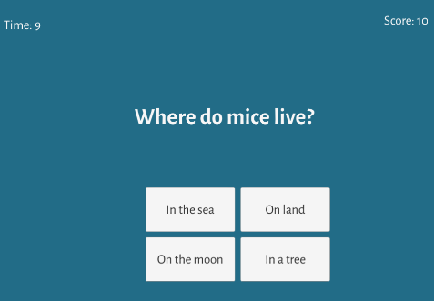
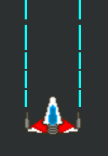

## Description :

# Example of feature :

- <a href="./README/Swipe/">Swipe</a>
View:

- <a href="./README/Quizz/">Quizz</a>
View:

- <a href="./README/ListAndDictionnary/">List and dictionnary</a>
View:

- <a href="./README/SavingData/">Saving Data</a>
View:

- <a href="./README/Pool/">Pool of objects</a>
View:

- <a href="./README/Coroutine/">Coroutine</a>
View:

- <a href="./README/Dragon2D/">Dragon2D</a>
View:

Go to Assets > Scripts > Subject for details

