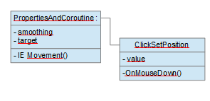
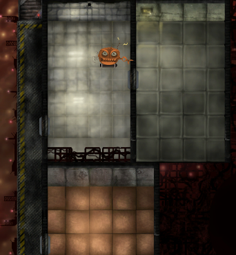

## Description :

Complete tuto is here :
https://unity3d.com/fr/learn/tutorials/topics/scripting/coroutines?playlist=17117

You need :
- Assets > Scenes > Coroutine
- Assets > Scripts > Coroutine
- Assets > Art > Coroutine

Describe a simple implementation of coroutine using IEnumerator interface

Object schema :

Result :

