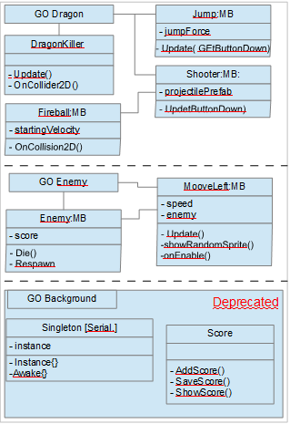
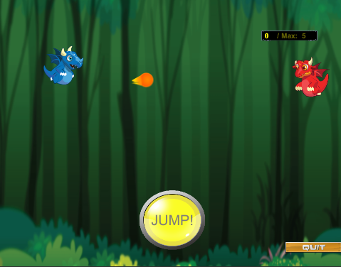

## Description :

Complete tuto is here :
https://unity3d.college/2019/06/05/how-to-make-a-game-in-unity-for-beginners/

You need :
- Assets > Scenes > Dragon2D
- Assets > Scripts > Dragon2D
- Assets > Prefabs > Dragon2D
- Assets > Font > Dragon2D
- Assets > Art > Dragon2D

To optimize

Object schema :

Result :

