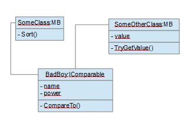
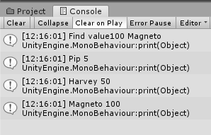

## Description :

Complete tuto is here :
https://unity3d.com/fr/learn/tutorials/modules/intermediate/scripting/lists-and-dictionaries?playlist=17117

You need :
- Assets > Scenes > ListAndDictionnary
- Assets > Scripts > ListAndDictionnary

Description of List<> implementation with Sort() method using IComparable interface
Description of Dictionnary<>

Object schema :

Result :

