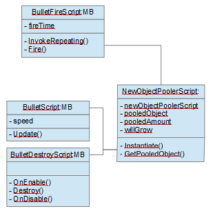

## Description :

Complete tuto is here :
https://unity3d.com/fr/learn/tutorials/topics/scripting/object-pooling?playlist=17117

You need :
- Assets > Scenes > Pool
- Assets > Scripts > Pool
- Assets > Prefabs > Pool
- Assets > Art > Pool

A pooling object to reuse

Object schema :

Result :

