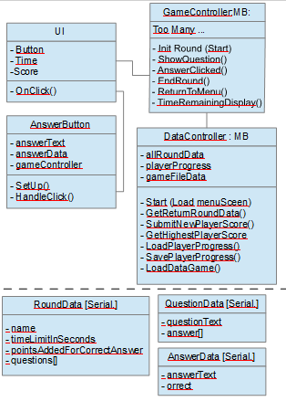
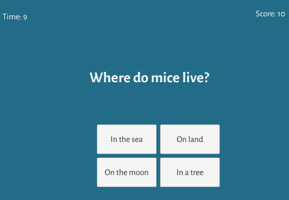

## Description :

Complete tuto is here :
https://unity3d.com/fr/learn/tutorials/topics/scripting/intro-part-two?playlist=17117

You need :
- Assets > Sprite > Quizz
- Assets > StreamingAssets > Quizz
- Assets > Scenes > Quizz
- Assets > Scripts > Quizz
- Assets > Prefabs > Quizz
- Assets > Font > Quizz
- Assets > Art > Quizz

Scene dependance: Persistent scene load MenuScreen which load Game

Object schema :

Result :

