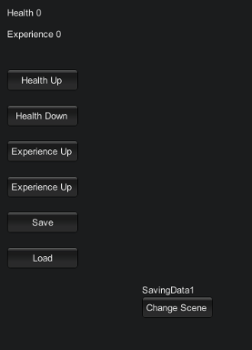

## Description :

Complete tuto is here :
https://unity3d.com/fr/learn/tutorials/topics/scripting/persistence-saving-and-loading-data?playlist=17117

You need :
- Assets > Scenes > SavingData
- Assets > Scripts > Saving Data
- Assets > Prefabs > SavingData

3 ways to save data :
- PlayerPrefs
- Singleton DontDestroyOnLoad()
- BinaryFormatter

Object schema :

Result :

