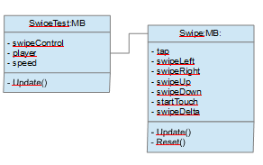

## Description :

Complete tuto is here :
https://www.youtube.com/watch?v=rDK_3qXHAFg

You need :
- Assets > Scenes > Swipe
- Assets > Scripts > Swipe
- Assets > Art > Swipe

Version Swipe generic with a controler script 

Object schema :

Result :

